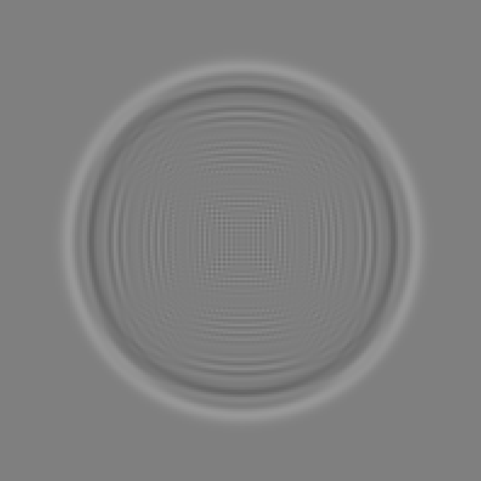

# Wave-Equation
A numerical solver for the wave equation written in C++. CUDA support is also added for physical simulation.

## Theory

### Wave Equation

The wave equation is a second-order linear partial differential equation that describes the motion of waves in a medium. The two dimensional equation reads:

$$
\frac{\partial^2 u}{\partial t^2} = c^2 \left( \frac{\partial^2 u}{\partial x^2} + \frac{\partial^2 u}{\partial y^2} \right)
$$

where $u(x, y, t)$ is the amplitude of the wave, $c$ is the wave speed, and $x$ and $y$ are the spatial coordinates.

## Example

The following image is the result of the simulation of a delta impulse in the center of the domain.

## Dependencies
- [SFML](https://www.sfml-dev.org/)

## Compilation
Compilation of all files can be done using `make` command.
As this project supports both CUDA and normal processing those two executables can be compiled seperately.
To compile only non-CUDA version run `make main.out` and to compile the CUDA version using nvcc run `make mainCUDA.out`.

## CPU vs CUDA
This project was tested on Ryzen 7 5800X CPU and Nvidia RTX3060 GPU. The performance difference is starking. Physics function call takes ~0.30 seconds on CPU and ~0.012 seconds on GPU.
That makes the CUDA version ~25x faster.